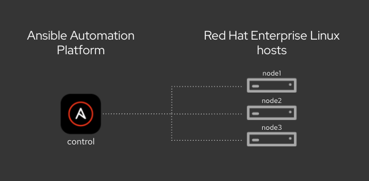

# Ansible Workshop - Ansible for Red Hat Enterprise Linux

**This is documentation for Ansible Automation Platform 2**

If you’re new to Ansible Automation, this workshop consists of two parts: 1) starting with the basic foundamentals and 2) applying what you’ve learned to implement Ansible automation controller to your enterprise use cases. You’ll start off by writing your first Ansible playbook, work on Jinja templates, and implement higher-level Ansible roles. Next you’ll get started on automation controller, understand inventory and credential management, projects, job templates, surveys, workflows and more.

After finishing this lab you are ready to start using Ansible for your automation requirements.

## Table of Contents

- [Ansible Workshop - Ansible for Red Hat Enterprise Linux](#ansible-workshop---ansible-for-red-hat-enterprise-linux)
  - [Table of Contents](#table-of-contents)
  - [Presentations](#presentations)
  - [Time planning](#time-planning)
  - [Lab Diagram](#lab-diagram)
  - [Section 1 - Command-line Ansible Exercises](#section-1---command-line-ansible-exercises)
  - [Section 2 - Ansible Automation Platform Exercises](#section-2---ansible-automation-platform-exercises)
  - [Supplemental Exercises](#supplemental-exercises)

## Presentations

The exercises are self explanatory and guide the participants through the entire lab. All concepts are explained when they are introduced.

There is an optional presentation available to support the workshops and explain Automation, the basics of Ansible and the topics of the exercises in more detail:
[Ansible RHEL Automation](../../decks/ansible_rhel.pdf)
[Google source - Red Hat only](https://docs.google.com/presentation/d/13PxRxjXem76R7ypY1eyuBlCt0iD_epPtohTMcYsZXMw/edit?usp=sharing)

Also have a look at our Ansible Best Practices Deck:
[Ansible Best Practices](../../decks/ansible_best_practices.pdf)

## Time planning

The time required to do the workshops strongly depends on multiple factors: the number of participants, how familiar those are with Linux in general and how much discussions are done in between.

Having said that, the exercises themselves should take roughly 4-5 hours. The first section is slightly longer than the second one. The accompanying presentation itself adds another hour.

## Lab Diagram

## Section 1 - Command-line Ansible Exercises

* [Exercise 1.1 - Check the Prerequisites](1.1-Prerequisites)
* [Exercise 1.2 - The Ansible Basics](1.2-Ansible Basics)
* [Exercise 1.3 - Writing Your First Playbook](1.3-Writing Your First Playbook)
* [Exercise 1.4 - Using Variables](1.4-Variables)

## Section 2 - Ansible Automation Platform Exercises

* [Exercise 2.1 - Introduction to Ansible Automation Platform](2.1-Introduction to Ansible Automation Platform)
* [Exercise 2.2 - Managing Inventories and Credentials in Ansible Automation Controller](2.2-Managing Inventories and Credentials in Ansible Automation Controller)
* [Exercise 2.3 - Projects & job templates](2.3-Projects & job templates)
* [Exercise 2.4 - Surveys](2.4-Surveys)
* [Exercise 2.5 - Role-based Access Control (RBAC)](2.5-Role-based Access Control (RBAC))
* [Exercise 2.6 - Workflows](2.6-Workflows)
* [Exercise 2.7 - Wrap up](2.7-Wrap up)

---

